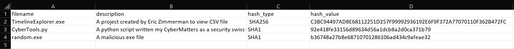
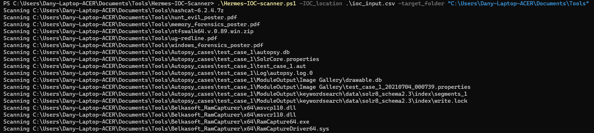
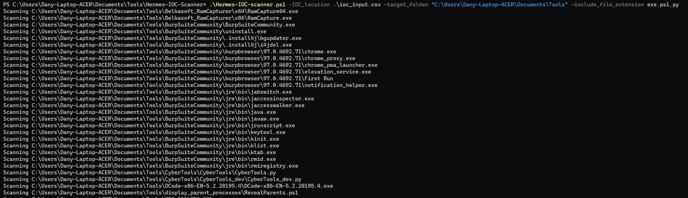
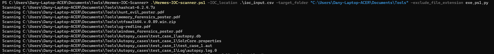
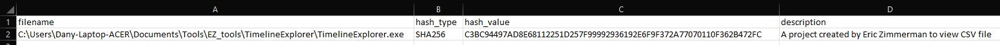

# Hermes

Program written by Dany Giang aka CyberMatters.

## Overview

Hermes, the Messenger of the Gods in Greek Mythology, was able to travel beyond boundaries and between the different worlds with ease and speed.

Hermes the IOC scanner is a portable IOC scanner for Windows systems which is easy to deploy and run:

- No installation is needed
	- The script just need PowerShell to run
	- And Powershell is natively available on Windows assets :wink:
- No agent is needed

Currently, the scanner looks for file hashes in the file system and can handle MD5, SHA1 and SHA256.
The output is under CSV format for ease of use and ingestion into other platforms if needed.

## Use cases

Both small and big organizations can face difficulties when it comes to continuously monitoring assets in their network across multiple environment.
Unfortunately, incident response only starts when malicious activity is detected. Quickly scanning an asset may help identify threats and allow for the incident response process to start.
Deploying Hermes could be done via:

- email
- file share
- deployment software
- download from internal server
- USB drive
- etc

### Reactive Hunting

- A SecOps team has been contacted because some Windows servers are behaving strangely?
- The account of "John Doe" is compromised, the SecOps team, wants to quickly analyze all the hosts which John has access to?

Hermes can embed the IOCs available in your threat intelligence platform and scan the server for presence of known threat.

### Proactive Hunting

A known source of intelligence warns the security community that APT123 is actively exploiting CVE-2023-1234.
It happens that the vulnerability has been recently patched on an exposed server. 
A SecOps wants to make sure there is no sign of APT123 on that server.

Hermes can embed the IOCs shared in the report/article and scan the server for the presence of the known threat.

## How-To

### Configure the IOC input list

Simply insert your indicators in the file called ioc_input.csv

### Run Hermes

Mandatory are `-IOC_location` (the path to your IOC input) and `-target_folder` (the folder to scan)

#### Run Hermes with file extension inclusion

Use the switch `-include_file_extension`

 
#### Run Hermes with file extension exclusion

Use the switch `-exclude_file_extension`

### Output

If there is a hit, then a CSV file is created and will contain useful information such as absolute path, hash, description

